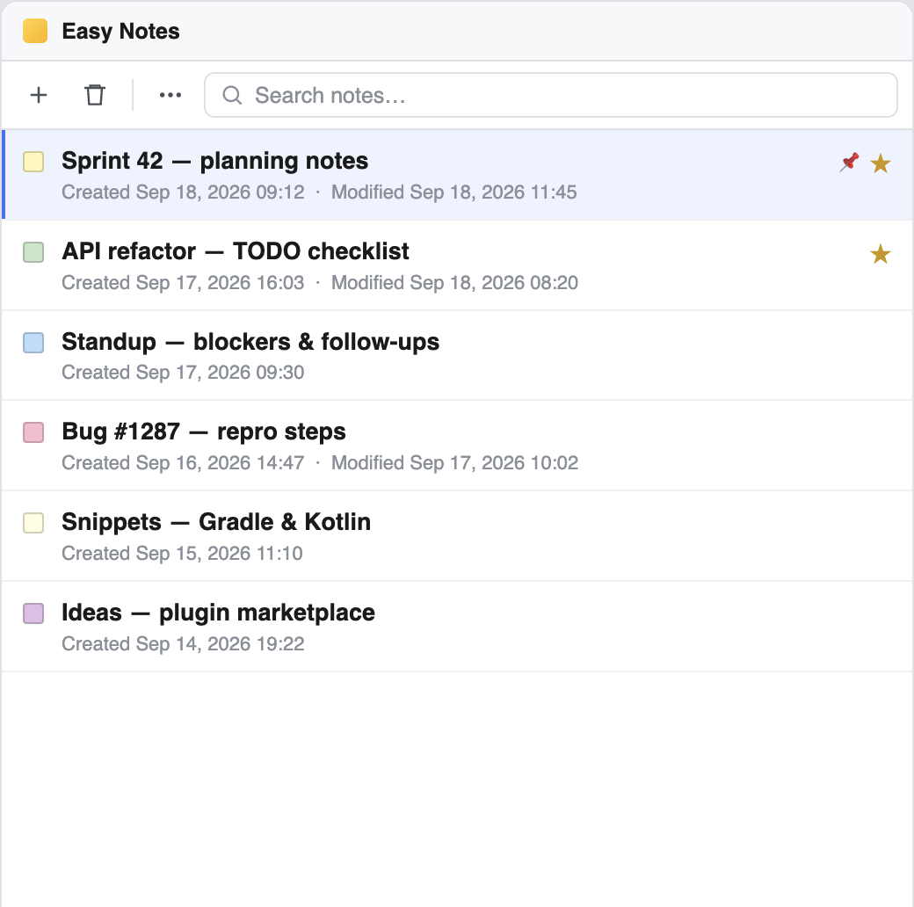
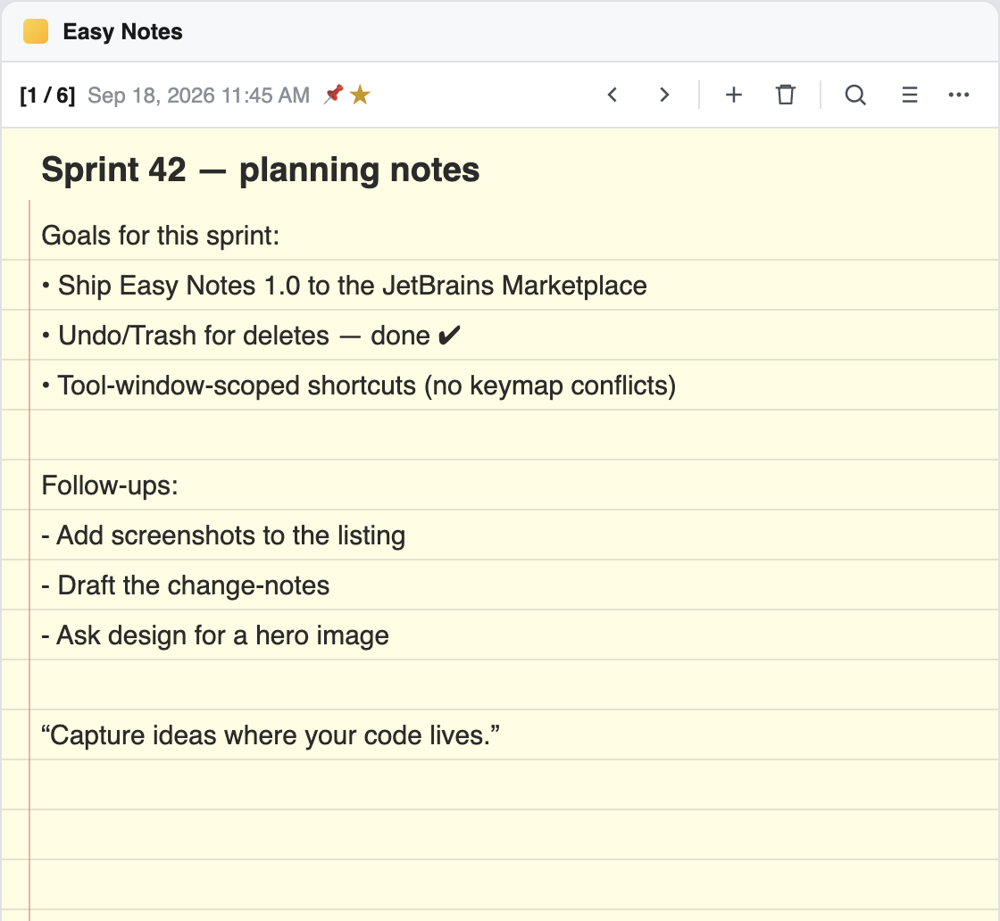

# Easy Notes

An IntelliJ Platform plugin for capturing ideas, TODOs, snippets, and meeting notes inside the IDE. Notes live in a legal-pad editor, auto-save, and persist across sessions and projects.

Plugin ID: `com.snagar.easynotes` · Version: `1.0.1` · License: [MIT](LICENSE)

Works in IntelliJ IDEA, Android Studio, PyCharm, WebStorm, GoLand, PhpStorm, Rider, CLion, and other IntelliJ-based IDEs (build **242** / 2024.2 and later).

<p align="center">
  
  
</p>

## Features

- Create, edit, and auto-save notes with custom titles (defaults to **Untitled Note**).
- Full-width ruled legal-pad editor; click a list item to open the note in the same tool window (list and editor are never shown together).
- Search, sort (title / created / last modified), pin, and favorite.
- Per-note background color (palette + custom picker).
- Previous / next navigation while a note is open.
- Delete selected notes, a checkbox chooser on the list, or delete all (with confirmation). Deletes can be undone from the balloon notification.
- Import and export JSON (full backup) and Markdown (frontmatter + heading), with skip / overwrite / keep-both conflict handling.
- Light and dark theme support via IntelliJ UI components.
- Notes stay on your machine: stored in the IDE config directory (`NotesPlugin.xml`). Nothing is uploaded unless you export.

## Requirements

- **JDK 21** to build
- An IntelliJ-based IDE, **2024.2 (build 242)** or newer, to run
- Gradle Wrapper is included (Gradle 9.5.0)

## Install from a zip

1. Build (see [Build](#build)) or download `easy-notes-1.0.1.zip` from `build/distributions/`.
2. In the IDE: **Settings → Plugins → ⚙ → Install Plugin from Disk…**
3. Select the zip and restart when prompted.
4. Open **View → Tool Windows → Easy Notes** (right dock by default).

## Usage

**List view**

- **+** creates a note and opens the editor.
- Search box filters by title and content.
- Click a note (or press **Enter**) to open it.
- **Delete** opens a chooser of notes to remove. **Delete** / **Backspace** removes the current selection. Right-click for Open / Delete / Delete all.
- **⋯ More**: favorites-only filter, sort, import, export, delete all.

**Editor view**

- Header shows `[index / total]`, last modified time, and pin/star markers.
- Title is the bold first line; body is the ruled pad. Changes auto-save after a short debounce.
- Toolbar: previous / next, new, delete, search, back to list, more (pin, star, color, import/export).

### Keyboard shortcuts

Shortcuts apply **only while the Easy Notes tool window is focused**, so they do not clash with the rest of the IDE. Remap them under **Settings → Keymap → Plug-ins → Easy Notes**.

| Action | macOS | Windows / Linux |
| --- | --- | --- |
| New note | ⌘N | Ctrl+N |
| Search | ⌘F | Ctrl+F |
| Open selected note (list) | Enter | Enter |
| Delete selected (list) | Delete / Backspace | Delete / Backspace |
| Previous / next note | ⌥↑ / ⌥↓ | Alt+Up / Alt+Down |
| Back to list | Esc | Esc |

## Build

Clone the repo and use the Gradle wrapper from the project root.

**macOS / Linux**

```bash
./gradlew test
./gradlew buildPlugin
```

**Windows** (Command Prompt)

```bat
gradlew.bat test
gradlew.bat buildPlugin
```

**Windows** (PowerShell)

```powershell
.\gradlew.bat test
.\gradlew.bat buildPlugin
```

Output zip: `build/distributions/easy-notes-1.0.1.zip`

### Target IDE for the sandbox build

Local builds compile against a **locally installed Android Studio** so you do not download a full IDE.

| OS | Default path |
| --- | --- |
| macOS | `/Applications/Android Studio.app/Contents` |
| Windows | `C:\Program Files\Android\Android Studio` |
| Linux | `/opt/android-studio` |

Override if Studio is installed elsewhere:

```bash
./gradlew buildPlugin -PlocalIdePath="/path/to/Android Studio.app/Contents"
```

Windows example:

```bat
gradlew.bat buildPlugin -PlocalIdePath="C:\Program Files\Android\Android Studio"
```

Or set `LOCAL_IDE_PATH` in the environment.

On CI (`CI=true`), the build uses a downloadable **IntelliJ IDEA Community** instead (`-PplatformVersion=2024.2` to override).

### Run a sandbox IDE

```bash
./gradlew runIde
```

This launches a throwaway IDE with Easy Notes loaded. It does not change your real Android Studio / IntelliJ install.

### Other useful tasks

```bash
./gradlew test            # JUnit 5 (JSON / Markdown / import merge)
./gradlew verifyPlugin    # JetBrains Plugin Verifier (downloads target IDEs)
./gradlew signPlugin      # Sign the zip (needs cert env vars; see Publishing)
./gradlew publishPlugin   # Upload to JetBrains Marketplace (after listing exists)
```

## Project layout

```
src/main/kotlin/com/snagar/easynotes/
  model/      Note, SortKey
  service/    Application-level persistence (PersistentStateComponent)
  io/         JSON reader/writer, Markdown, import merge
  ui/         Tool window, list, legal-pad editor
  actions/    Toolbar actions (DumbAware)
src/main/resources/META-INF/   plugin.xml, pluginIcon.svg
src/test/kotlin/               NotesIO unit tests
marketing/                     Listing screenshots
.github/workflows/             Build on push; publish on v* tags
```

There are **no third-party runtime libraries**. JSON import/export uses a small in-house parser so the distribution stays small (~80 KB zip).

## Privacy

Notes are stored locally as `NotesPlugin.xml` in the IDE configuration directory (application-level, shared across projects). The plugin does not send data to a network. Export is the only way notes leave the machine.

## CI and release

- **Build** (`.github/workflows/build.yml`): on `main` and pull requests — `test`, `buildPlugin`, `verifyPlugin`, upload the zip artifact.
- **Release** (`.github/workflows/release.yml`): on tags `v*` — `publishPlugin` with signing.

Repository secrets for release:

| Secret | Purpose |
| --- | --- |
| `CERTIFICATE_CHAIN` | Plugin signing certificate (PEM) |
| `PRIVATE_KEY` | Signing private key |
| `PRIVATE_KEY_PASSWORD` | Key password |
| `PUBLISH_TOKEN` | JetBrains Marketplace token |

## Publishing (JetBrains Marketplace)

The plugin id `com.snagar.easynotes` is **permanent** after the first upload. Do not change it.

1. Generate a signing certificate ([Plugin Signing](https://plugins.jetbrains.com/docs/intellij/plugin-signing.html)).
2. Sign and upload the zip once at [plugins.jetbrains.com/plugin/add](https://plugins.jetbrains.com/plugin/add) to create the listing. Attach MIT license, repo URL, and the images in `marketing/`.
3. Add the four GitHub secrets above.
4. Later versions: bump `version` in `build.gradle.kts` and `<version>` / `<change-notes>` in `plugin.xml`, then `git tag v1.0.1 && git push --tags`.

A version with a suffix such as `1.0.0-beta.1` publishes to the **beta** channel; a plain `1.0.0` goes to **default**.

See also: [Publishing a Plugin](https://plugins.jetbrains.com/docs/intellij/publishing-plugin.html).

## License

[MIT](LICENSE) © 2026 Shubham Nagar
